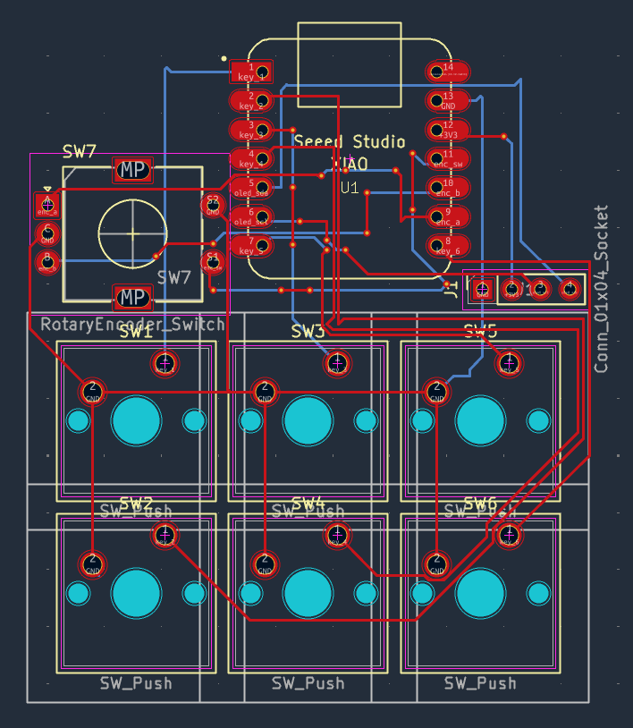
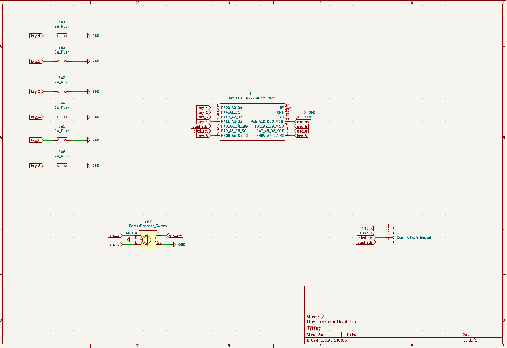

 # seven pin

Hi my name is harshit and i started this project 3 days ago with no knowledge of hardware etc and this journey took 3 days in short like this 
day1: created the schematic, pcb design 
day 2: completed the pcb and started on case 
day 3:completed the case 
in this project i have 6 keys , rotatory dial and 1 mini oled screen used 

## hardware
it has Seeed Studio XIAO RP2040 as the main microcontroller

## firmware structure

it uses KMK and is structured like this :

-SW1: Copy (Ctrl+C)
-SW2: Paste (Ctrl+V)
-SW3: Cut (Ctrl+X)
-SW4: Undo (Ctrl+Z)
-SW5: Save (Ctrl+S)
-SW6: Select All (Ctrl+A)
-Dial: Volume Up / Down & Mute

## softwares used:
1) kicad for pcb schematic and design
2) fusion360 for case design
3) vs code and kmk KMK to write the firmware

## licence
MIT

## installation
you can install this by clicking on the big green code button and then clicking "download as ZIP"

## 3D Case Design & Assembly

### Overall Views
| Isometric / Angled View | Top View |
| :---: | :---: |
|  |  |

| Front / Branding View | Side Profile |
| :---: | :---: |
|  |  |

---

## PCB Layout

---

## Schematic

---

## Bill of Materials (BOM)

| Item | Quantity | Description |
| :--- | :--- | :--- |
| Seeed Studio XIAO RP2040 | 1 | Main microcontroller board |
| Mechanical Switches (Cherry MX style) | 6 | Key switches |
| Rotary Encoder (EC11) | 1 | Encoder with push button |
| 0.91" I2C OLED Display | 1 | 128x32 display module |
| 1x4 Female Header Pin Socket | 1 | 2.54mm socket for OLED |
| 3D Printed Case Parts | 1 Set | Top plate, middle walls, bottom plate, custom knob |
| M2 / M3 Screws | 4 | Case assembly fasteners |

---

hope you will love it ;)
